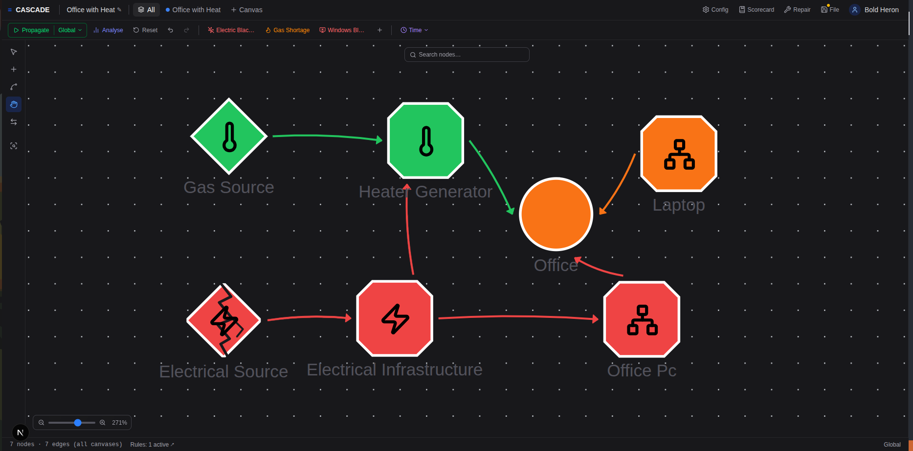

# CASCADE

[](https://github.com/cascade-platform-org/CASCADE/actions/workflows/ci.yml)
[](LICENSE)

CASCADE lets you model interdependent infrastructure — power, water, heat,
digital, personnel — as a graph, then simulate how a failure in one Element
propagates through the network via a rule-driven propagation engine. Build the
network on a visual canvas, define dependency and recovery rules, and replay
the cascade step by step.



See [CONTEXT.md](CONTEXT.md) for the domain glossary and
[CLAUDE.md](CLAUDE.md) for development guidelines.

**Arrived from one of the papers?** [`docs/papers.md`](docs/papers.md) maps each
section to the code that implements it, and shows how to reproduce the reported
numbers.

## Layout

| Path              | What                                                        |
| ----------------- | ----------------------------------------------------------- |
| `CASCADE-app/`     | Next.js frontend (static-export SPA)                       |
| `CASCADE-backend/` | FastAPI backend + propagation engine                       |
| `deploy/`          | Docker Compose stack (db, backend, web/Caddy, Zitadel)     |
| `docs/`            | Project docs (`project/`) and decision records (`adr/`)    |

## Develop

Run the full stack locally (HTTP, auth disabled):

```bash
cd deploy
cp .env.example .env        # then edit; chmod 600 .env
docker compose up -d --build
#   app  http://localhost:8080     api  http://localhost:8080/api/health
```

See [docs/project/deployment.md](docs/project/deployment.md) for the production
(HTTPS + Zitadel) deployment and the go-live checklist.

## Test

```bash
# Backend. DB-integration tests need a Postgres; without one they skip.
cd CASCADE-backend
docker run -d --name pg -e POSTGRES_PASSWORD=pw -p 5433:5432 postgres:16
TEST_DATABASE_URL=postgresql://postgres:pw@localhost:5433/postgres python -m pytest -q
ruff check .

# Frontend
cd CASCADE-app && npm ci && npx tsc --noEmit && npm run build
```

## CI

Every push to `main` and every pull request runs
[`.github/workflows/ci.yml`](.github/workflows/ci.yml): backend lint + tests
(against a real Postgres) + Pydantic→JSON-Schema drift check, frontend
type-check + build, docs integrity + internal-link check, and Docker
image/compose validation.

**Recommended:** protect `main` so changes must pass CI before merging —
GitHub → *Settings → Branches → Add branch protection rule* for `main`, enable
*Require status checks to pass before merging*, and select the **Backend**,
**Frontend**, **Docs**, and **Docker** checks.

## Contributing

Issues and pull requests are welcome — see [CONTRIBUTING.md](CONTRIBUTING.md)
for the workflow and the DCO sign-off (`git commit -s`) required on every
commit.

## Licence

**GNU Affero General Public License v3.0 or later** (`AGPL-3.0-or-later`) — full
text in [LICENSE](LICENSE), rationale and third-party components in
[NOTICE](NOTICE).

The clause that matters in practice is AGPL §13: if you run a **modified**
version as a network service, you must offer its source to that service's users.
Running, reading, modifying and citing the code for research triggers no
obligation at all — obligations attach only to distribution and to providing a
network service.

If you use CASCADE in academic work, please cite it via
[CITATION.cff](CITATION.cff) (GitHub renders a *Cite this repository* button from
it).

Contributions are accepted under the same licence — see
[CONTRIBUTING.md](CONTRIBUTING.md) for the sign-off requirement.
